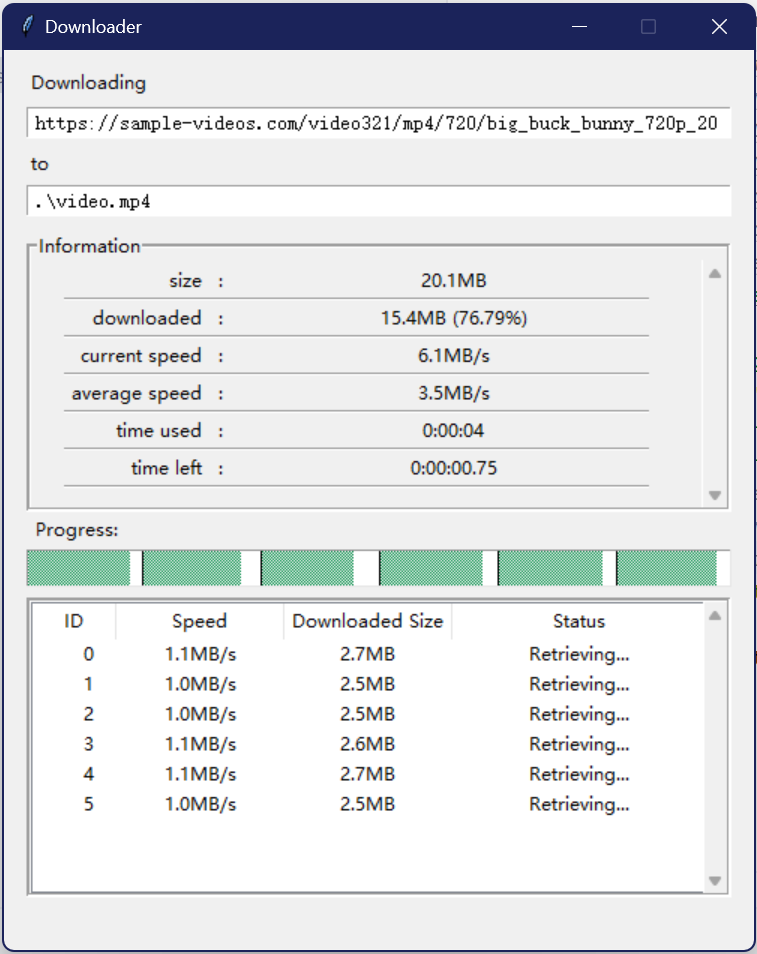

# High-Speed Python Downloader

## Table of Contents
- [Introduction](#introduction)
- [Features](#features)
- [UI interface](#ui-interface)
- [Sample Usage](#sample-usage)
- [Contribution](#contribution)

## Introduction
This Python downloader module provides a high-performance, cross-platform solution for downloading files. With a user-friendly UI, it supports multi-threading, auto-resume capability, and fast download speeds. It is highly optimized for downloading large files, such as videos.

It has been tested to be robust against connection failures.

Built with Python and tkinter. 

## Features
- **Multi-threaded downloads** for increased speed and efficiency.
- **Resume capability** to continue interrupted downloads. 
- **User-friendly UI** shows stats and thread status.
- **Progress tracking** visualizes download progress for each worker thread.

## UI Interface



## Sample Usage
1. Clone the repository:
   ```bash
   git clone https://github.com/your-username/your-repo-name.git
2. Import download_with_progress:
   ```python
   import download_with_progress from hsrequest
3. define url, headers and call the function:
   ```python
   url = "https://sample-videos.com/video321/mp4/720/big_buck_bunny_720p_20mb.mp4"
   headers = {
       'User-Agent': 'Mozilla/5.0 (Macintosh; Intel Mac OS X 10.13; rv:56.0) Gecko/20100101 Firefox/56.0',
       'Accept': '*/*',
       'Accept-Language': 'en-US,en;q=0.5',
       'Accept-Encoding': 'gzip, deflate, br',
       'Connection': 'keep-alive',
   }
   download_with_progress(r'.\video.mp4', url, headers=headers, timeout=10, thread_count=6, method='GET')
4. A UI will pop up. Simply wait until download finishes!

## Contribution
Any bug report or feature improvement is welcome! Please do not hesitate to create an issue or a PR if you want to contribute to the project.
